# Finance Tracker Enhancement Plan

```mermaid
flowchart TD
    A[Core Features] --> B[UI/UX Improvements]
    A --> C[Advanced Analytics]
    A --> D[Integration Hub]
    A --> E[Security & Compliance]

    B --> B1[Modern Dashboard]
    B --> B2[Mobile Experience]
    B --> B3[Customization]
    B --> B4[Accessibility]

    B1 --> B1.1[Interactive Widgets]
    B1 --> B1.2[Real-time Updates]
    B1 --> B1.3[3D Charts & Animations]
    B1 --> B1.4[Custom Themes]

    B2 --> B2.1[Native Apps]
    B2 --> B2.2[Offline Mode]
    B2 --> B2.3[Touch Gestures]
    B2 --> B2.4[Biometric Auth]

    B3 --> B3.1[Widget Library]
    B3 --> B3.2[Layout Editor]
    B3 --> B3.3[Custom Reports]
    B3 --> B3.4[Data Views]

    C --> C1[AI Features]
    C --> C2[Predictive Analysis]
    C --> C3[Smart Alerts]
    C --> C4[Data Insights]

    C1 --> C1.1[NLP Queries]
    C1 --> C1.2[Auto-Categorization]
    C1 --> C1.3[Fraud Detection]
    C1 --> C1.4[Smart Assistant]

    C2 --> C2.1[Cash Flow Forecast]
    C2 --> C2.2[Budget Optimization]
    C2 --> C2.3[Investment Advice]
    C2 --> C2.4[Risk Analysis]

    D --> D1[Banking]
    D --> D2[Payment Systems]
    D --> D3[Business Tools]
    D --> D4[Data Sources]

    D1 --> D1.1[Open Banking APIs]
    D1 --> D1.2[Global Banks]
    D1 --> D1.3[Crypto Wallets]
    D1 --> D1.4[Investment Accounts]

    E --> E1[Authentication]
    E --> E2[Data Protection]
    E --> E3[Compliance]
    E --> E4[Audit System]

    E1 --> E1.1[Multi-factor Auth]
    E1 --> E1.2[SSO Integration]
    E1 --> E1.3[Role-based Access]
    E1 --> E1.4[API Security]
```

## Phase 1: Enhanced UI/UX (Current Focus)

### Dashboard Improvements
- [ ] Add 3D interactive charts using Three.js
- [ ] Implement smooth transitions and animations
- [ ] Create draggable and resizable widgets
- [ ] Add custom widget marketplace

### Mobile Experience
- [ ] Implement responsive touch gestures
- [ ] Add offline-first functionality
- [ ] Optimize performance for mobile devices
- [ ] Add mobile-specific features (QR scanning, NFC)

### Customization
- [ ] Create theme builder with custom color palettes
- [ ] Add layout persistence per user
- [ ] Implement widget configuration system
- [ ] Add custom data visualization options

## Phase 2: Advanced Analytics

### AI Integration
- [ ] Implement natural language query system
- [ ] Add smart transaction categorization
- [ ] Create anomaly detection system
- [ ] Develop AI-powered financial advisor

### Predictive Analysis
- [ ] Implement cash flow forecasting
- [ ] Add budget optimization suggestions
- [ ] Create investment opportunity detection
- [ ] Add risk assessment system

## Phase 3: Integration Hub

### Banking Connections
- [ ] Implement Open Banking API integration
- [ ] Add support for global banking systems
- [ ] Create crypto wallet integration
- [ ] Add investment account tracking

### Business Tools
- [ ] Add QuickBooks/Xero integration
- [ ] Implement invoice management
- [ ] Create expense approval workflow
- [ ] Add payroll system integration

## Phase 4: Security & Compliance

### Authentication
- [ ] Implement biometric authentication
- [ ] Add hardware key support
- [ ] Create SSO integration
- [ ] Implement IP-based access control

### Data Protection
- [ ] Add end-to-end encryption
- [ ] Implement secure data backup
- [ ] Create data retention policies
- [ ] Add GDPR compliance tools

## Next Steps

1. Enhance current dashboard with:
   - 3D charts and animations
   - Draggable widgets
   - Custom themes
   - Real-time updates

2. Improve mobile experience with:
   - Touch gestures
   - Offline support
   - Performance optimizations

3. Add advanced features:
   - AI-powered insights
   - Predictive analytics
   - Smart notifications
   - Custom reporting

4. Implement integrations:
   - Banking APIs
   - Payment systems
   - Business tools
   - Data sources

5. Enhance security:
   - Multi-factor authentication
   - End-to-end encryption
   - Compliance tools
   - Audit system
