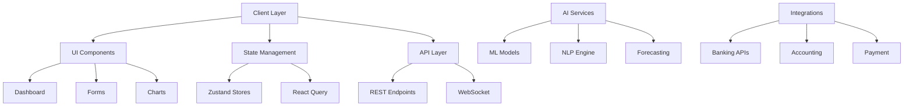

# Finance Tracker Implementation Plan

## Phase 1: Core UI/UX Foundation ✅
- [x] Basic project setup with Next.js, TypeScript, and Tailwind CSS
- [x] Implement responsive dashboard layout
- [x] Create theme provider with dark/light mode toggle
- [x] Add sidebar navigation
- [x] Implement draggable widget system
- [x] Create dashboard settings panel

## Phase 2: Authentication & Account Management ✅
- [x] Create auth store with Zustand
- [x] Implement login and registration pages
- [x] Add authentication middleware
- [x] Set up protected routes
- [x] Add logout functionality
- [x] Create account store with Zustand
- [x] Design account setup form with validation
- [x] Implement accounts list view
- [x] Add account sync functionality

## Phase 3: Transaction Management 🚧
- [ ] Create transaction list view with filters
- [ ] Implement transaction import UI
- [ ] Add receipt upload component with OCR integration
- [ ] Build transaction categorization system
- [ ] Create reconciliation interface

## Phase 3: Budgeting & Forecasting
- [ ] Design budget creation wizard
- [ ] Implement budget vs actual tracking
- [ ] Create variance alerts system
- [ ] Add cash flow forecasting UI
- [ ] Implement expense anomaly detection
- [ ] Build notification system for alerts

## Phase 4: AI & Analytics Integration
- [ ] Set up ML pipeline for transaction categorization
- [ ] Implement natural language query interface
- [ ] Create anomaly detection visualization
- [ ] Add AI-powered insights dashboard
- [ ] Build cash flow prediction charts
- [ ] Implement auto-tagging system

## Phase 5: Reporting & Data Export
- [ ] Create custom report builder
- [ ] Implement chart customization
- [ ] Add PDF/Excel export functionality
- [ ] Build saved reports library
- [ ] Create report sharing interface
- [ ] Add report scheduling system

## Phase 6: Integration & API Connectors
- [ ] Implement Plaid/Yodlee connection flow
- [ ] Create webhook listeners for Stripe/Shopify
- [ ] Add QuickBooks/Xero OAuth integration
- [ ] Build API documentation interface
- [ ] Create integration status dashboard
- [ ] Implement sync history view

## Phase 7: Security & Collaboration
- [ ] Implement JWT authentication
- [ ] Create role-based access control
- [ ] Build audit log viewer
- [ ] Add user management interface
- [ ] Implement sharing & permissions
- [ ] Create activity feed

## Phase 8: PWA & Performance
- [ ] Configure service worker
- [ ] Implement offline data sync
- [ ] Add push notifications
- [ ] Create app installation flow
- [ ] Optimize performance & loading
- [ ] Add error boundary & fallbacks

## Technical Architecture

## Current Progress
- Completed basic UI setup with theme support
- Implemented responsive dashboard layout
- Added draggable widget system with persistence
- Created settings panel for customization
- Implemented chart components with animations
- Added authentication system with login/register
- Implemented protected routes with middleware
- Added account management functionality
- Created account setup form with validation
- Implemented account sync functionality
- Added logout functionality

## Next Steps
1. Implement transaction management interface
2. Add transaction import functionality
3. Create receipt OCR processing
4. Build transaction categorization
5. Implement budget management system
6. Add AI-powered insights

## Notes
- All AI/ML features will initially use mock data
- Third-party integrations will be stubbed
- Focus on modular architecture for easy extension
